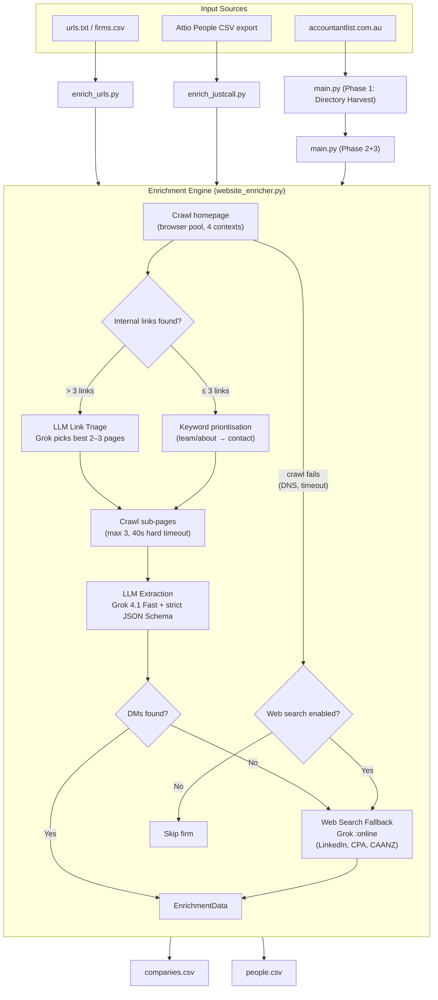

# Firm Website Enricher — Technical Guide

## What This Does

This toolkit crawls firm websites and uses an LLM to extract structured company and people data (decision-maker names, titles, phone numbers, emails, LinkedIn profiles). It outputs Attio CRM-ready CSVs.

There are **three entry points**:

| Script | Purpose | Input |
|---|---|---|
| **`enrich_urls.py`** | Generic URL enricher — the main tool. Takes any list of firm URLs, crawls and enriches them, exports company + people CSVs. | `.txt` (one URL per line) or `.csv` with a `url` column |
| **`enrich_justcall.py`** | Attio People enricher — backfills poor-quality existing Attio People records by crawling their company websites. | Attio People CSV export |
| **`main.py`** | AccountantList directory scraper — harvests listings from accountantlist.com.au, then enriches and deduplicates. | None (scrapes the directory) |

`enrich_urls.py` is the general-purpose tool. The other two are specialised wrappers for specific workflows.

---

## Quick Start

```bash
cd scraper
source venv/bin/activate

# Copy .env.example to .env and set your API keys (see Environment Variables below)

# Enrich a list of URLs
python3 enrich_urls.py --input urls.txt

# Preview without crawling
python3 enrich_urls.py --input firms.csv --dry-run

# Test with 5 URLs
python3 enrich_urls.py --input urls.txt --limit 5

# Full run with higher concurrency
python3 enrich_urls.py --input urls.txt --concurrency 6 --output data/output/my_run
```

---

## Architecture



---

## How Enrichment Works (Per Firm)

1. **Homepage crawl** — a headless Chromium browser loads the page (30s timeout), converts to markdown.
2. **Link triage** — all internal links are evaluated. If >3, Grok picks the 2–3 most likely to contain decision-maker info. If ≤3, keyword matching handles it. Service/blog pages are filtered out.
3. **Sub-page crawl** — the selected pages are crawled (max 3, each with a 40s hard timeout).
4. **LLM extraction** — the combined markdown is sent to Grok 4.1 Fast via OpenRouter with a strict JSON Schema. Output: company description, phones, emails, decision-maker details, social links.
5. **Phone normalisation** — all numbers are normalised to E.164 format via the `phonenumbers` library.
6. **Web search fallback** — if the crawl finds no named decision makers (or fails entirely), a web search is triggered using xAI's native search plugin targeting LinkedIn, CPA Australia, CAANZ, and IPA directories.
7. **Checkpoint** — every result is saved to a JSON file immediately, enabling resume on restart.

---

## Input Formats for `enrich_urls.py`

### TXT (one URL per line)

```
https://www.example-accounting.com.au
https://smithandco.com.au
taxpartners.com.au
```

Lines starting with `#` are ignored. URLs without `http://` are accepted if they contain a `.`.

### CSV

Must have one of these columns: `url`, `website`, `domain`, `website_url`, `domains`.
Optionally include a name column: `name`, `firm`, `company`, `company_name`, `firm_name`.

```csv
url,name
https://www.example-accounting.com.au,Example Accounting
https://smithandco.com.au,Smith & Co
```

If no name column is present, the domain is used as the firm name.

---

## Output CSVs

### `companies.csv`

| Column | Description |
|---|---|
| `domains` | Bare domain (e.g. `example-accounting.com.au`) |
| `name` | Firm name |
| `description` | Factual company description from the LLM |
| `edited_description` | Bullet-point firmographic brief for sales reps |
| `office_phone` | Main office number (E.164) |
| `office_email` | Main reception email |
| `associated_mobiles` | Other mobile numbers found (semicolon-separated) |
| `associated_emails` | Other emails found (semicolon-separated) |
| `associated_info` | Memberships, software, niches |
| `organisational_structure` | solo practice / SMB / enterprise / franchise |
| `linkedin` | Company LinkedIn URL |
| `facebook` | Company Facebook URL |
| `dm_1_name` | First decision maker's name (quick reference) |
| `enrichment_status` | `enriched_with_dms`, `enriched_no_dms`, `no_data`, or `out_of_scope: <reason>` |

### `people.csv`

| Column | Description |
|---|---|
| `first_name` | First name |
| `last_name` | Last name |
| `email_addresses` | Email |
| `job_title` | Title (Partner, Director, etc.) |
| `phone_numbers` | All phone numbers (semicolon-separated, E.164) |
| `linkedin` | Personal LinkedIn URL |
| `company_name` | Associated firm name |
| `company_domain` | Associated domain |

When no named decision makers are found but contact details exist, a fallback "Contact at [Firm Name]" record is created so data isn't lost.

---

## CLI Reference

### `enrich_urls.py`

```
--input       Path to .txt or .csv file (required)
--output      Output directory (default: data/output/url_enrichment)
--checkpoint  Checkpoint file (default: data/state/url_enrichment_checkpoint.json)
--concurrency Concurrent crawls (default: 4)
--delay       Delay between crawls in seconds (default: 1.0)
--limit       Process only first N URLs (for testing)
--dry-run     Preview URLs without crawling
--skip-dedup  Skip Attio deduplication
```

### `enrich_justcall.py`

```
--input       Path to Attio People CSV export (required)
--output      Output CSV path (default: data/output/attio_people_enriched.csv)
--checkpoint  Checkpoint file (default: data/state/justcall_enrichment_checkpoint.json)
--concurrency Concurrent crawls (default: 4)
--limit       Process only first N unique domains
--dry-run     Preview domains without crawling
```

### `main.py` (directory pipeline)

```
--phase       Run only phase 1, 2, or 3 (default: all)
--states      Limit to states, e.g. --states VIC NSW
--skip-enrichment  Skip Phase 2
--skip-dedup       Skip Attio deduplication
--checkpoint       Checkpoint file path
```

---

## File Map

```
scraper/
├── enrich_urls.py          # Generic URL enricher (main tool)
├── enrich_justcall.py      # Attio People backfill enricher
├── main.py                 # AccountantList directory pipeline
├── website_enricher.py     # Core enrichment engine (crawl4ai + LLM)
├── models.py               # All Pydantic models + LLM JSON schemas
├── config.py               # Settings (loads from .env)
├── checkpoint.py           # JSON-based checkpointing for resume
├── exporter.py             # Builds CompanyRecord/PersonRecord, writes CSVs (for main.py)
├── attio_dedup.py          # Checks Attio API for existing records
├── phone_utils.py          # E.164 phone normalisation
├── segment_mapper.py       # Maps accountancy areas → Attio segments (for main.py)
├── requirements.txt        # Python dependencies
├── .env                    # API keys and feature flags
└── data/
    ├── state/              # Checkpoint JSON files (resumable)
    └── output/             # Generated CSVs
```

### Core files (used by all entry points)

- **`website_enricher.py`** — the enrichment engine. Manages the browser pool, link triage, crawling, LLM extraction, and web search fallback. This is the most complex file.
- **`models.py`** — Pydantic models for all data structures. The `LLMEnrichmentResponse` and `LLMWebSearchResponse` classes define the strict JSON schemas sent to the LLM. If you need to change what data the LLM extracts, edit the field descriptions here.
- **`config.py`** — all settings with defaults. Feature flags like `web_search_enabled` and `llm_link_triage` live here.
- **`checkpoint.py`** — simple JSON persistence. Stores enrichment results keyed by URL.
- **`phone_utils.py`** — `normalize_to_e164()` converts Australian numbers to `+61XXXXXXXXX`.

### Directory-pipeline-specific files

- **`directory_scraper.py`** — Phase 1 scraper for accountantlist.com.au (httpx + BeautifulSoup).
- **`segment_mapper.py`** — maps accountancy areas to Attio segment values.
- **`exporter.py`** — builds Attio-ready CSVs with address parsing and dedup status columns.

---

## LLM Configuration

| Setting | Value | Why |
|---|---|---|
| **Model** | `x-ai/grok-4.1-fast` via OpenRouter | Fast, cheap, excellent structured output compliance |
| **Web search model** | `x-ai/grok-4.1-fast:online` | Same model with xAI native web search plugin |
| **Structured output** | `response_format: json_schema` (strict) | Forces output to conform to Pydantic schema exactly |
| **Temperature** | 0.0 | Deterministic, factual extraction |

### Cost per firm (approximate)

- Extraction: ~$0.003 (3K prompt + 1K completion tokens)
- Web search (when triggered): ~$0.005 (includes search plugin fee)
- Link triage: ~$0.0003

---

## Key Design Decisions

### Browser Pool
Pre-warms N persistent Playwright browser contexts at startup. Tasks borrow a context from an async queue and return it when done. Eliminates the 70–150s first-page-load contention from concurrent browser launches.

### Hard Timeout
`asyncio.wait_for` wraps every `crawler.arun()` call with a cap of `page_timeout + 10s`. Prevents slow/hanging sites from blocking a browser context. Times-out gracefully fall back to web search.

### LLM Link Triage
After the homepage, Grok evaluates all internal links and picks the 2–3 most likely to contain decision-maker info (team pages, about pages, contact pages). Prevents wasting crawl budget on service descriptions and blog posts.

### Strict JSON Schema
All LLM output uses OpenRouter's strict JSON Schema mode. Schemas are auto-generated from Pydantic models and enforced server-side (all properties required, no additional properties). Zero parsing failures.

### Web Search Fallback
When a site crawl finds no named decision makers, the enricher searches the web using xAI's native search plugin, targeting LinkedIn, CPA Australia, CAANZ, and IPA directories.

### Checkpointing
Every result is persisted to JSON immediately. All scripts can be stopped and resumed without re-processing completed firms.

---

## Environment Variables

```env
# Required
OPENROUTER_API_KEY=sk-or-v1-...

# Optional (defaults shown)
OPENROUTER_MODEL=x-ai/grok-4.1-fast
ATTIO_API_KEY=                          # Only needed for dedup / Attio People enrichment
WEB_SEARCH_ENABLED=true
WEB_SEARCH_MODEL=x-ai/grok-4.1-fast:online
LLM_LINK_TRIAGE=true
PAGE_TIMEOUT=30000                      # milliseconds
```

See `config.py` for the full list with defaults and validation ranges.

### Running on Railway (keys don’t carry over from GitHub)

**Fix “Error creating build plan with Railpack”:** Your app lives in `scraper/`, but Railway builds from the repo root by default, so it doesn’t see `requirements.txt`. In the Railway dashboard: open your **service** → **Settings** → **Root Directory** → set to **`scraper`** and save. Redeploy so the build runs from `scraper/` and Railpack detects Python. The repo root has a `railway.json` that sets the start command to `python main.py`; change it in Railway or in that file if you want a different entry point (e.g. `enrich_justcall.py`).

`.env` is **not** in the repo (it’s in `.gitignore`), so your API keys are never pushed. On Railway you set the same variables in the dashboard; the app already reads from `os.environ`, so no code changes are needed.

1. **Railway dashboard** → your project → **Variables** (or **Settings** → **Variables**).
2. Add each variable from `.env.example` with the same **name** and your real **value**:

   | Variable | Required | Notes |
   |----------|----------|--------|
   | `OPENROUTER_API_KEY` | Yes | From [OpenRouter](https://openrouter.ai) |
   | `OPENROUTER_MODEL` | No | Default: `x-ai/grok-4.1-fast` |
   | `OPENROUTER_BASE_URL` | No | Default: `https://openrouter.ai/api/v1` |
   | `ATTIO_API_KEY` | If using dedup/Attio | From Attio → Settings → API |
   | `JINA_API_KEY` | If using Jina/PDF | From [Jina](https://jina.ai) |
   | `DIRECTORY_DELAY` | No | e.g. `1.0` |
   | `DIRECTORY_MAX_CONCURRENT` | No | e.g. `5` |
   | `MAX_CONCURRENT_CRAWLS` | No | e.g. `5` |
   | `PAGE_TIMEOUT` | No | e.g. `30000` |
   | `MAX_DECISION_MAKERS` | No | e.g. `3` |
   | `LLM_TEMPERATURE` | No | e.g. `0.0` |
   | `WEB_SEARCH_ENABLED` | No | `true` / `false` |
   | `WEB_SEARCH_MAX_RESULTS` | No | e.g. `3` |
   | `WEB_SEARCH_MODEL` | No | e.g. `x-ai/grok-4.1-fast:online` |
   | `LLM_LINK_TRIAGE` | No | `true` / `false` |
   | `OUTPUT_DIR` | No | e.g. `data/output` |

3. Redeploy so the new variables are picked up.

If you use the Railway CLI: `railway variables set OPENROUTER_API_KEY=sk-or-v1-...` (and so on for each key).

---

## Troubleshooting

| Issue | Fix |
|---|---|
| `crawl4ai` / Playwright errors | `pip install crawl4ai && playwright install chromium` inside the venv |
| DNS failures on certain sites | The enricher automatically retries with `http://` when `https://` fails |
| Slow first page loads | Increase browser pool size (`--concurrency`) or check system resources |
| LLM not finding decision makers | Check `web_search_enabled=true` in `.env`; review link triage in logs |
| Resuming after interruption | Just re-run the same command — checkpointing handles it automatically |
